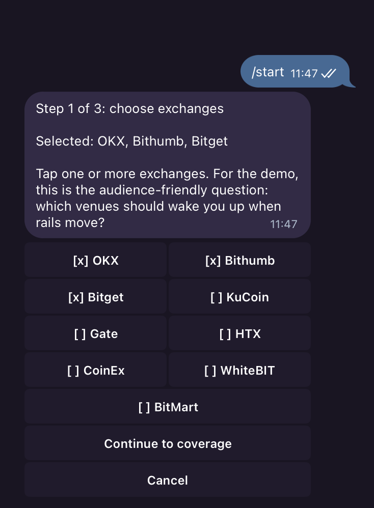
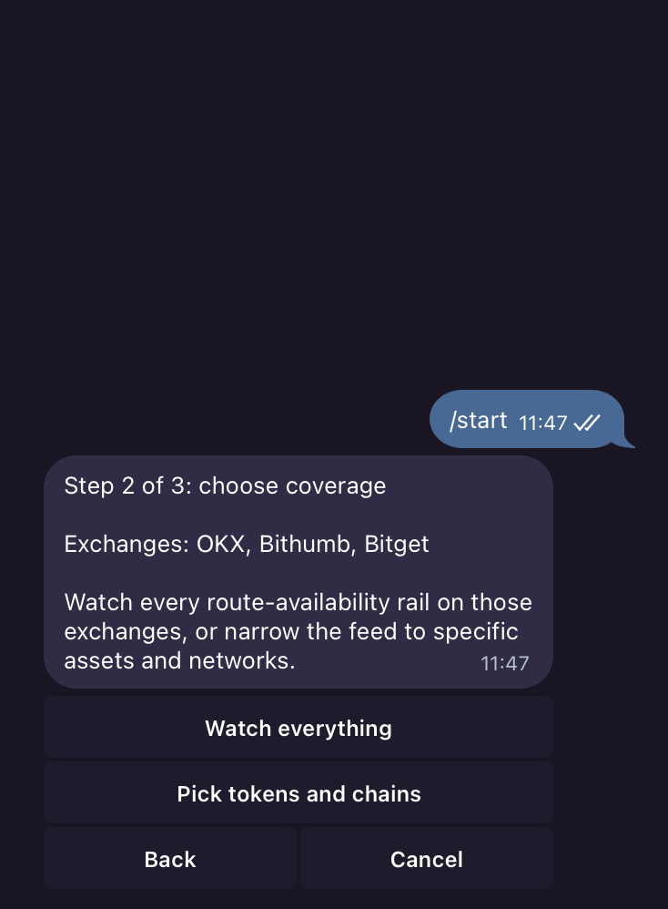
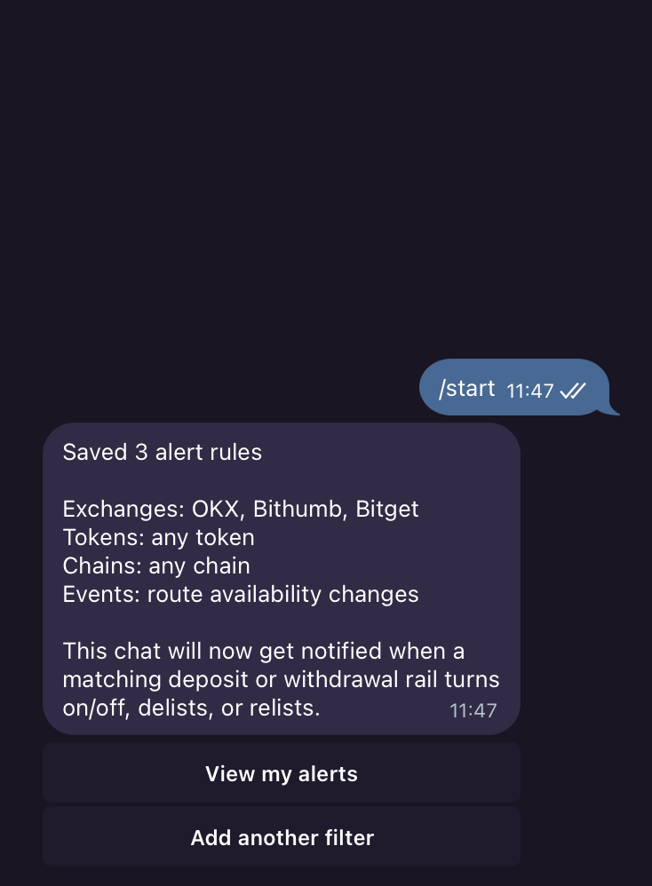

# CEXYROUTER

```text
 ██████╗███████╗██╗  ██╗██╗   ██╗██████╗  ██████╗ ██╗   ██╗████████╗███████╗██████╗
██╔════╝██╔════╝╚██╗██╔╝╚██╗ ██╔╝██╔══██╗██╔═══██╗██║   ██║╚══██╔══╝██╔════╝██╔══██╗
██║     █████╗   ╚███╔╝  ╚████╔╝ ██████╔╝██║   ██║██║   ██║   ██║   █████╗  ██████╔╝
██║     ██╔══╝   ██╔██╗   ╚██╔╝  ██╔══██╗██║   ██║██║   ██║   ██║   ██╔══╝  ██╔══██╗
╚██████╗███████╗██╔╝ ██╗   ██║   ██║  ██║╚██████╔╝╚██████╔╝   ██║   ███████╗██║  ██║
 ╚═════╝╚══════╝╚═╝  ╚═╝   ╚═╝   ╚═╝  ╚═╝ ╚═════╝  ╚═════╝    ╚═╝   ╚══════╝╚═╝  ╚═╝

  ░▒▓█ live CEX rail status · cross-chain routes · push alerts █▓▒░  [SEABW '26]
```

CEXYROUTER monitors centralized exchange deposit and withdrawal rails, normalizes token and chain names, finds usable cross-exchange routes, and pushes status changes to a web UI, WebSocket clients, REST consumers, and Telegram.

The hackathon demo path is built around three visible moments: live route availability, controlled route status changes, and Telegram alerts that users can filter by exchange, token, and chain.

<p align="center">
  
  
  
</p>

<p align="center"><em>Three taps from <code>/start</code> to a live rail-status alert: pick exchanges → pick coverage → confirm.</em></p>

## What It Does

- Ingests CEX rail metadata from exchange APIs.
- Normalizes exchange-specific token and chain names into canonical coins and chains.
- Maps verified wrapped-asset contract addresses to the right ticker when the exchange provides a contract.
- Stores rail state in Postgres/Timescale and emits change events.
- Serves a route finder, event feed, health checks, REST endpoints, and WebSocket updates.
- Runs a Telegram bot with clickable alert setup and reset controls.

## Services

- `cmd/api`: REST API, WebSocket feed, admin endpoints, and static web UI.
- `cmd/ingester`: exchange polling, normalization, diffing, and event creation.
- `cmd/bot`: Telegram command UI and alert dispatcher.
- `cmd/migrate`: database migrations.
- `cmd/demo-outage`: controlled outage/recovery event for demos.
- `cmd/smoke-adapters`, `cmd/e2e-smoke`, `cmd/normalization-audit`, `cmd/alias-audit`, `cmd/route-audit`: verification tools.

## Quick Start

```sh
cp .env.example .env
docker compose up -d db
make migrate
make dev
```

Then open:

```sh
curl http://localhost:8080/healthz
```

The default `INGESTER_EXCHANGES` uses public endpoints only:

```text
bithumb,bitget,kucoin,gate,htx,coinex,whitebit,bitmart
```

Add `okx`, `binance`, `bybit`, or `upbit` only when matching read-only credentials are present in `.env`.

To run the Telegram bot locally, set `TELEGRAM_BOT_TOKEN` and start the bot service:

```sh
make dev-bot
```

## Useful Commands

```sh
make test
make build
make smoke-adapters
make normalization-audit
make route-audit
make demo-outage
make dev-bot
```

For the full local demo runner:

```sh
make demo
```

For a one-shot ingestion cycle:

```sh
INGESTER_RUN_ONCE=true go run ./cmd/ingester
```

## Configuration

All secrets and environment-specific values belong in `.env` or the deployment provider, never in source control. `.env.example` contains placeholders only.

Required core values:

- `DATABASE_URL`
- `LISTEN_ADDR` for the API
- `TELEGRAM_BOT_TOKEN` for the bot

Optional private exchange credentials:

- `BINANCE_API_KEY`, `BINANCE_API_SECRET`
- `BYBIT_API_KEY`, `BYBIT_API_SECRET`
- `OKX_API_KEY`, `OKX_API_SECRET`, `OKX_PASSPHRASE`
- `UPBIT_API_KEY`, `UPBIT_API_SECRET`

Optional audit enrichment:

- `CMC_API_KEY`

## API Surface

- `GET /healthz`
- `GET /v1/routes`
- `GET /v1/route-options`
- `GET /v1/events`
- `GET /v1/rails`
- `GET /ws/events`

The OpenAPI spec lives at `api/openapi.yaml`.

## Telegram Bot

Users can configure alerts through clickable Telegram buttons:

- Choose exchanges.
- Receive everything for selected exchanges, or narrow to tokens and chains.
- View the active alert summary.
- Reset alert settings.

Broad "all" alerts are intentionally limited to availability changes by default so users are not flooded by fee/minimum churn.

## Deployment Notes

The repo includes Dockerfiles and `railway.json` for a three-service deployment:

- API
- ingester
- bot

Run migrations before starting long-lived services:

```sh
go run ./cmd/migrate up
```

## Safety Checks

Before publishing or deploying:

```sh
make test
go mod verify
gitleaks detect --source . --no-git --redact --config .gitleaks.toml
```

The pre-commit hook in `.githooks/pre-commit` runs gitleaks when installed:

```sh
make setup-hooks
```

## Credits

Built for a hackathon demo by Tomas.

Co-authored by Codex and Claude.
